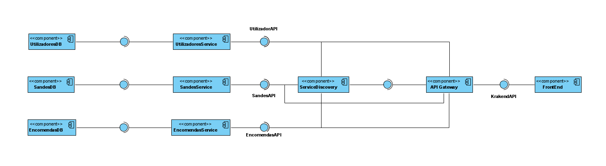

# Project - Gorgeous Sandwich

## Used Technologies
    - Java (SpringBoot)
    - Angular
    - Docker
    - H2 Database
    - Krakend API

## Git Organization 

The project was developed over 2 iterations, part 2 and 3 represent both iterations.
both folders contain visual, descriptive documentation and the planned implementation for the projects. 

- [Part 2](part2/design/3Iteração/README.md)
- [Part 3](part3/design/Iteracao1/README.md)

## Project description

Academic project developed with the support of several technologies and frameworks. It intends to apply several standards , good software engineering practices and document with UML support.

Microservices oriented, it consists of 3 APIs that communicate with each other for the management of different entities. A service discovery component to compose the APIS guidance, an API gateway used for the purpose of centralizing the location of obtaining information and a _SPA_ where the information is presented

## Componentes

* Microservice:
    * The microservices were developed in an identical way, supported by _SpringBoot_ to connect to the database, the entities were created with the support of _Javax_ annotations.
    * Requests are taken through the 3 layers of binding, controller, service and repository.
    * _Swagger_ used to document the api.
    * Register all the API to the service discovery.
    * _DTO_ used to communicate out of service.
* Service discovery:
    * Developed with support from _Eureka SpringBoot_.
* FrontEnd:
    * Simple angular application.
    * Multiple language support.
 

